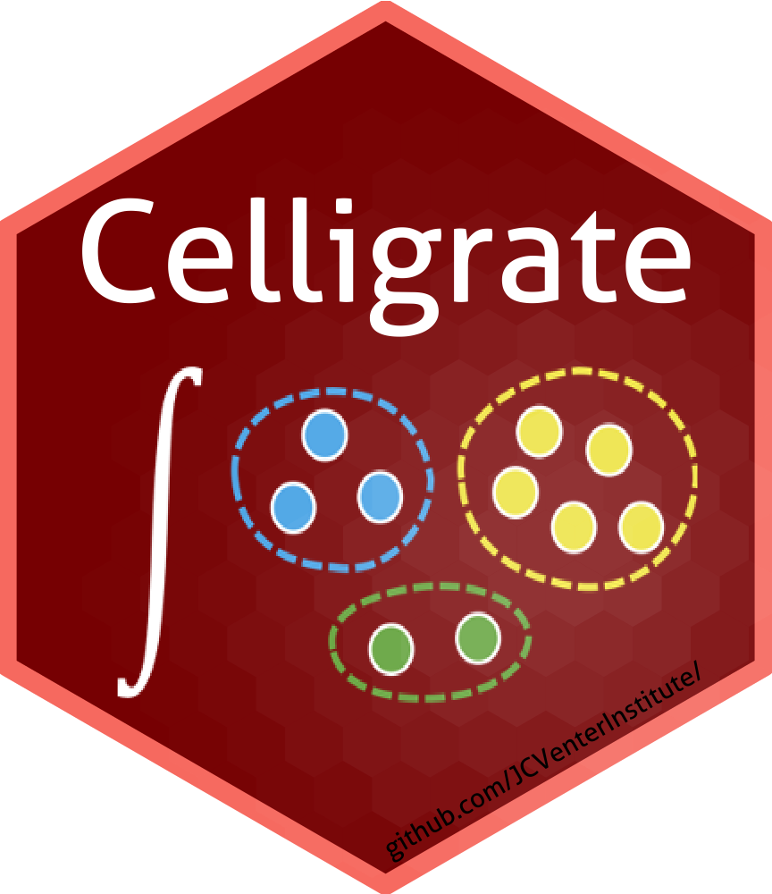
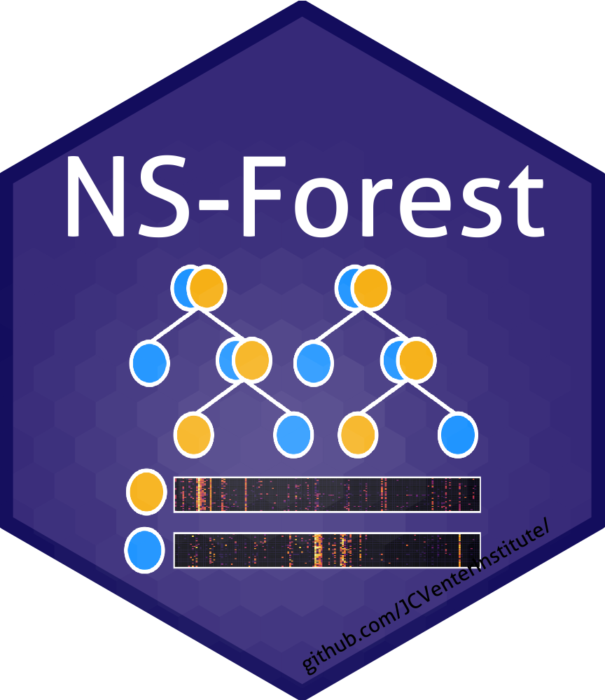
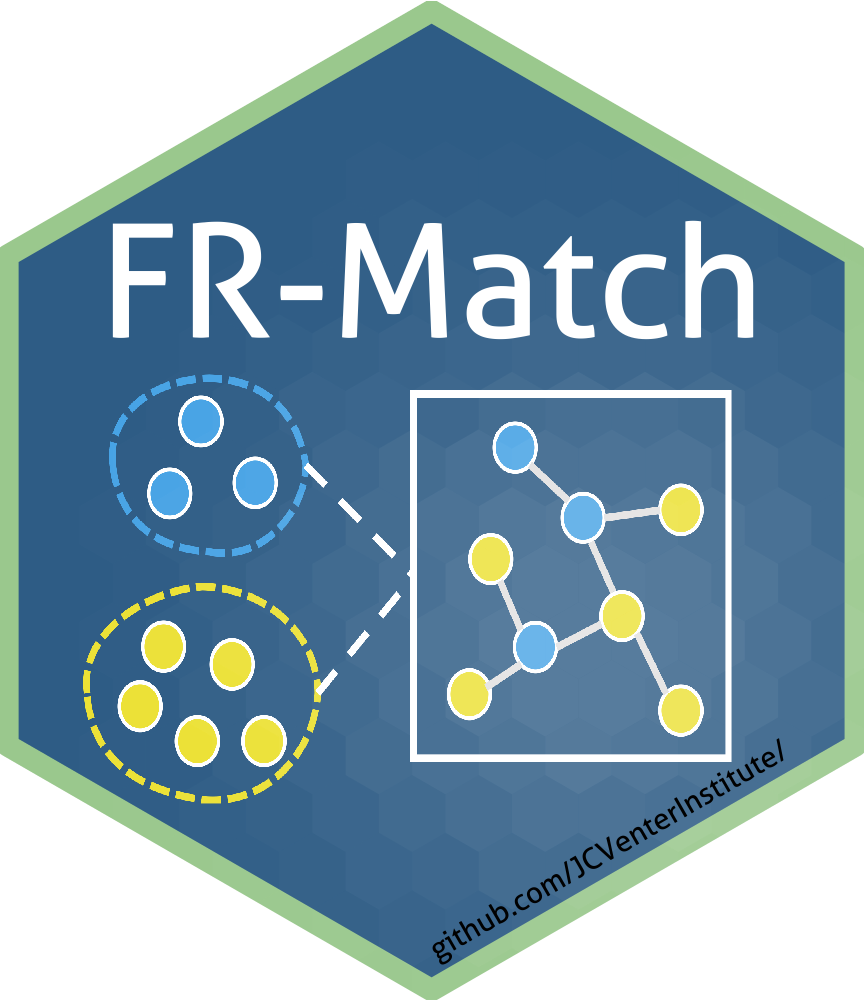

---
#
# By default, content added below the "---" mark will appear in the home page
# between the top bar and the list of recent posts.
# To change the home page layout, edit the _layouts/home.html file.
# See: https://jekyllrb.com/docs/themes/#overriding-theme-defaults
#
layout: home
title: Welcome to Celligrate!
---

**Celligrate** is a project for cell type characterization and integration from single cell RNA-sequencing (scRNA-seq) data. The backbone of Celligrate consists of two carefully-designed and extensively-validated computational algorithms: NS-Forest and FR-Match. [NS-Forest](https://github.com/JCVenterInstitute/NSForest) is a random forest machine learning algorithm for cell type marker gene identification. [FR-Match](https://github.com/JCVenterInstitute/FRmatch) is a topological graph theory-based statistical learning algorithm for cell type matching. Celligrate also introduces a notion of “cell type barcode” for insightful visualization of cell type expression data. The use of Celligrate extends the utility of the upstream scRNA-seq analysis pipelines to downstream use cases, and ultimately accelerates the growth of knowledge about cell types by pooling results from individual studies.  

See [Methods](https://jcventerinstitute.github.io/celligrate/methods/) for more details.

# Software Suite

[{:height="150px" width="125px"}](https://github.com/JCVenterInstitute/celligrate)
[{:height="150px" width="125px"}](https://github.com/JCVenterInstitute/NSForest)
[{:height="150px" width="125px"}](https://github.com/JCVenterInstitute/FRmatch)

# Tutorials

* [Tutorial 1: FR-Match data object + matching across overlapping neuroanatomical regions (Layer 1 and full MTG)](https://jcventerinstitute.github.io/celligrate/FRmatch-vignette.html)
* [Tutorial 2: Matching across non-overlapping neuroanatomical regions (M1 and MTG)](https://jcventerinstitute.github.io/celligrate/tutorial-M1-MTG.nb.html)
* [Tutorial 3: Matching mouse M1 cell subclasses across different sample types (scRNAseq and snRNAseq)](https://jcventerinstitute.github.io/celligrate/tutorial-mouse-M1-10X-scRNAseq-snRNAseq.nb.html)
* [Tutorial 4: Matching human M1 cell subclasses across different platforms (SMART-seq and 10X)](https://jcventerinstitute.github.io/celligrate/tutorial-huamn-M1-10X-SS4.nb.html)
* [Tutorial 5: Cell type calling for spatial transcriptomics data (smFISH and scRNAseq)](https://jcventerinstitute.github.io/celligrate/tutorial-smFISH.nb.html)

## Demo data in the tutorials

The demo data storage is under migration.  For any inquiries, please contact <zhangy@jcvi.org>.

# News
