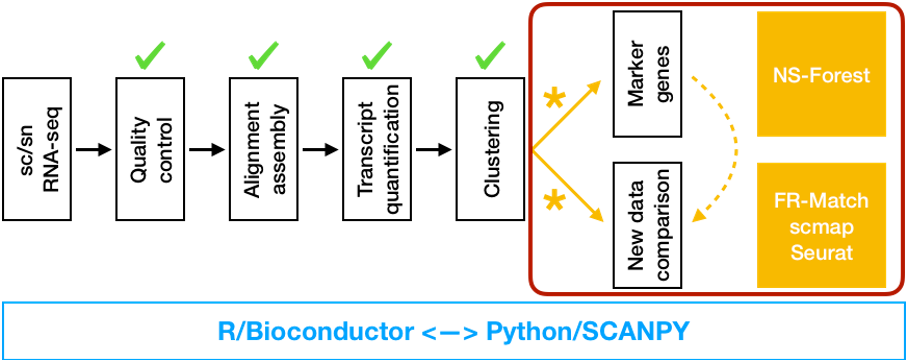

---
#
# By default, content added below the "---" mark will appear in the home page
# between the top bar and the list of recent posts.
# To change the home page layout, edit the _layouts/home.html file.
# See: https://jekyllrb.com/docs/themes/#overriding-theme-defaults
#
layout: home
---

**Celligrate** is a project to develop an essential software package for *downstream* cell type characterization and integration of single cell RNA-sequencing (scRNA-seq) datasets. Celligrate includes two customized learning methods: the [NS-Forest](https://github.com/JCVenterInstitute/NSForest)  (a machine learning-based method for cell type-specific marker gene selection) and [FR-Match](https://github.com/JCVenterInstitute/FRmatch) (a statistical learning method for cluster-to-cluster cell type matching) packages developed by our group, which can be applied to scRNA-seq gene expression matrices with cell cluster membership information. The use of Celligrate extends the utility of the upstream scRNA-seq analysis pipelines to downstream use cases, and ultimately accelerates the growth of knowledge about cell types by pooling results from individual studies.  

## Motivation of Celligrate

Global collaborations, including the [Human Cell Atlas (HCA)](https://www.humancellatlas.org/) and the [BRAIN Initiative](https://braininitiative.nih.gov/), have made rapid advancements in the application of single cell/nucleus RNA-sequencing (sc/snRNA-seq) to characterize cells in the healthy and diseased human body, as the basis for understanding fundamental human biological processes and diagnosing, monitoring, and treating disease. Current efforts in the scRNA-seq community have been focused on developing analytical methods and software tools for the processing, clustering, and visualization of scRNA-seq data. However, a significant gap exists in the software stack between the end-products of the existing workflows (i.e. the clustered gene expression matrices) and important downstream uses of these data for the identification of cell type-specific marker genes and for the statistical comparison of cell type characteristics across studies.

Existing and new sc/snRNA-seq data need to go through quality control, alignment, assembly, transcript quantification, and clustering before integration into a reference dataset.  The Celligrate project is developing duo versions (R/Bioconductor and Python/SCANPY) of essential software for downstream analysis steps of cell type marker gene identification and cell type matching (* highlighted in yellow) from scRNA-seq clustering results.

## Methods

### NS-Forest

[NS-Forest](https://github.com/JCVenterInstitute/NSForest) is a feature selection algorithm originally developed in Python that uses the Random Forest machine learning method to identify minimum sets of marker genes that are necessary and sufficient to mark specific cell types.

### FR-Match

[FR-Match](https://github.com/JCVenterInstitute/FRmatch) is a statistical learning method for comparing multivariate data distributions using the Friedman-Rafsky (FR) non-parametric test to determine cell type equivalence of query and reference scRNA-seq cell clusters, originally written in R.  FR-Match utilizes clustered expression matrices together with the NS-Forest marker genes to match query cell type cluster from one study to zero, one, or more cell type clusters from another study or in a reference database.

## Future Directions

We are building a self-contained extensible software infrastructure for cell type matching using NS-Forest/FR-Match and two other established matching methods - [scmap](https://github.com/hemberg-lab/scmap) for cell-to-cluster mapping and [Seurat](https://github.com/satijalab/seurat) for cell-to-cell alignment - to close the gap between individual study scRNA-seq analyses and integrated cell type knowledge extraction. The proposed infrastructure will include independently-implemented analytical software modules, API interface with primary data sources (e.g. [HCA DCP](https://www.humancellatlas.org/data-sharing)), and compatibility with different programming languages, including Python/SCANPY and R/Bioconductor.

