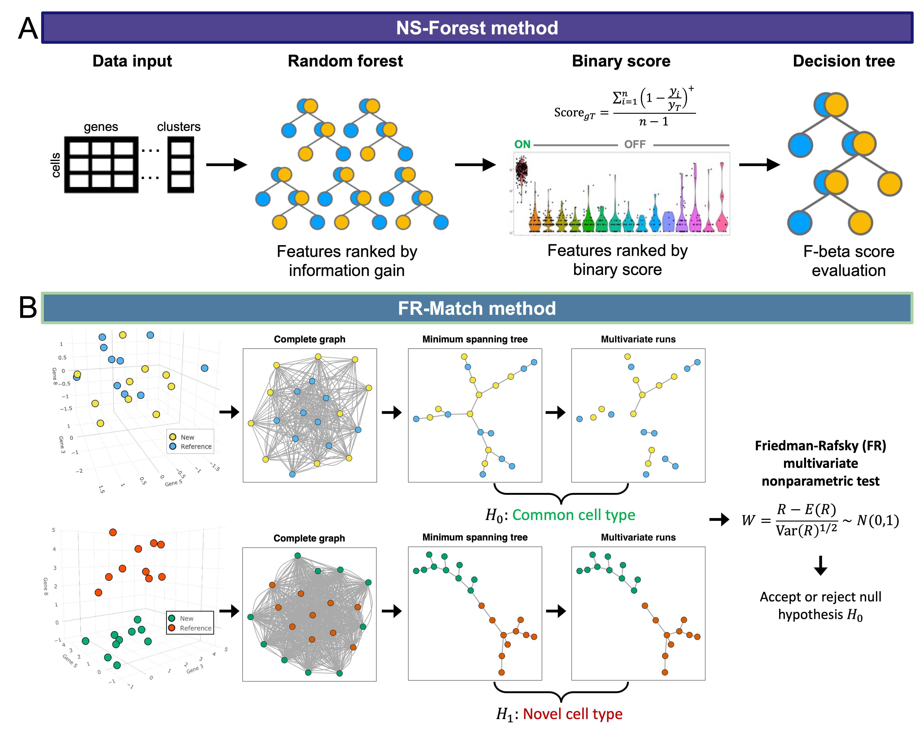

Our lab has developed two carefully-designed and validated machine learning and statistical methods for cell type-specific marker gene selection and cell type matching of single cell transcriptomic profiling data.  [NS-Forest](https://github.com/JCVenterInstitute/NSForest) is a random forest machine learning-based algorithm that selects the minimum set of necessary and sufficient (NS) marker genes to characterize the defining distinctions of different cell types. [FR-Match](https://github.com/JCVenterInstitute/FRmatch) is a graph theoretical approach to identify common and novel cell types using the multivariate nonparametric statistical test, [Friedman-Rafsky (FR) test](https://doi.org/10.1214/aos/1176344722). These methods form the backbone of the Celligrate workflow.

### NS-Forest

The NS-Forest algorithm (Figure A) takes the clustered cell-by-gene expression matrix and ranks the feature importance by the Gini index values calculated in the random forests classifiers.  The Gini index-sorted features are great for machines to build quantitative classifiers, but they may not be the best candidates for certain biological and experimental use cases that require on-off binary signals in downstream applications, e.g., designing probes for PCR or multiplex FISH assays.  We constructed a novel binary score based on the median expression levels within and across clusters to preferentially rank the positively-expressed binary gene features higher.  The double-ranked feature list is used to determine the minimum set of features that gives the best classification accuracy in decision tree classifiers measured by the F-beta measure.  

### FR-Match

FR-Match is a novel application of the Friedman-Rafsky (FR) nonparametric statistical test for multivariate data comparison using minimum spanning tree graph analysis applied to single cell clustering results.  FR-Match takes clustered gene expression matrices from query and reference experiments and returns the FR statistic with p-value as evidence that two cell clusters are matched or not, i.e., sharing a common gene expression profile pattern.  In brief, the algorithm automatically detects whether cell clusters are intermixed with each other or segregated from each other in the selected feature space based on their joint minimum structure tree topology (Figure B).

# Normalization

